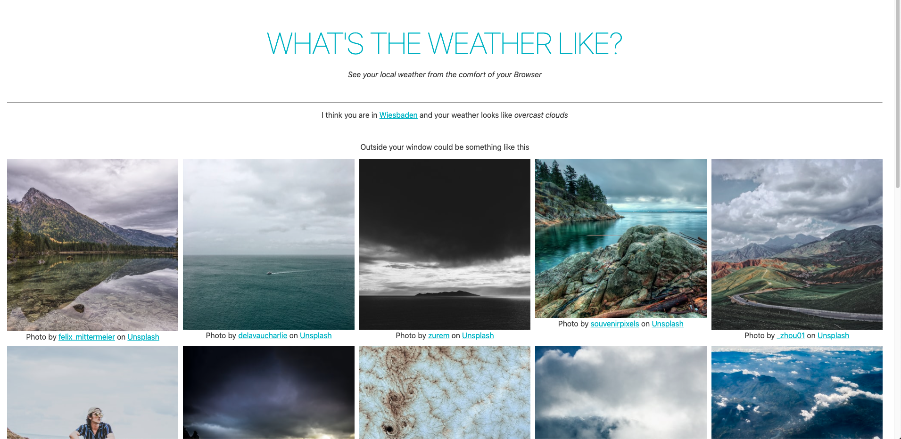

# TL;DR
I wrote an Application that fetches the weather based on
the location associated with your IP-Address and displays
images matching you current weather description.

I used [Svelte](https://https://svelte.dev/), [OpenWeather](https://home.openweathermap.org/), [Unsplash](https://unsplash.com/) and [Netlify](https://netlify.com/).



 Check the [site](https://weather.jeinfeldt.net).

# Motivation
Sometimes you just can't be bothered to look out the window.

And sometimes you still want to know *What's the weather like?*

Also I really wanted to check out Svelte.

# Running
Local server
```bash
npm run dev
```
Netlify development server including lambda functions

```bash
netlify dev
```

Build for production use 
```bash
npm run dev
```

# Deployment
Happens on push to master. APIs are integrated using [Netlify Functions](https://www.netlify.com/products/functions/) which is a wrapper for AWS Lambdas.
I did this to not display the used credentials.

And also I can now tick off Serverless Functions from my hype list.

# Open Tasks
* Smoother loading effect
* Add proper error handling
* Cleanup code
* Cleanup styling

# License
WTFPL license <br>
<a href="http://www.wtfpl.net/"></a>
